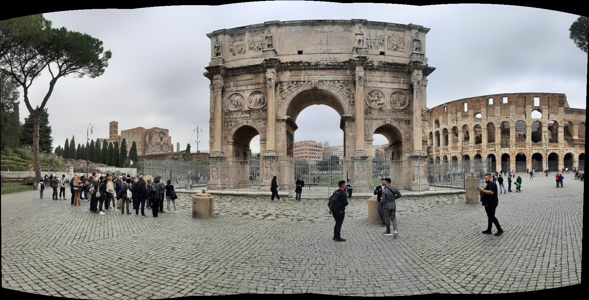

⚠ Dear UNIVR colleagues, stars are free of charge ;) ⚠

# ComputerVision
Image stitching project for the Computer Vision course @ UNIVR

Most of the necessary instructions can be found inside the `main.py` file.
The `main_cv.py` file offers a comparison between my custom implementation and the OpenCV dedicated pipeline.

## Results
 

 

